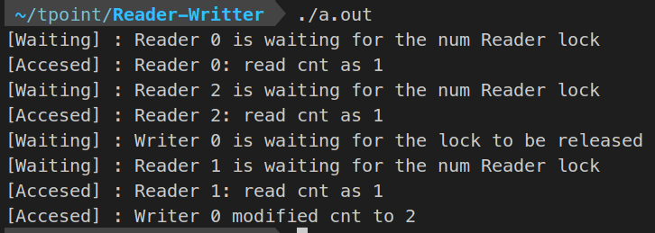
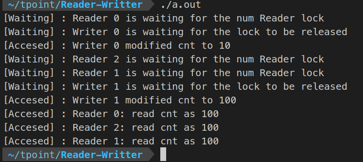
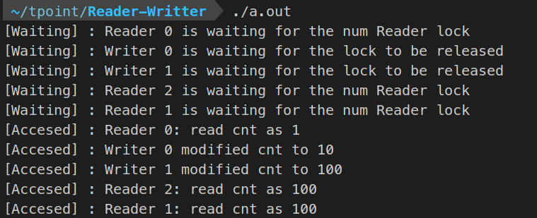

# Reader Writter Problem

## Varition-1
---
 we need to ensure that , if multiple threads are waiting on queue, then the readers will be allowed to access the resource even when the writers are still on the queue.

## Varition-2
---

if multiple threads are waiting on queue, then the writers will be allowed to access the resource even when the readers are still on the queue.

## Variation-3
---
 both the readers and the writers will be given a equal weightage. 

 

### Basic Blockchain using RW logic
