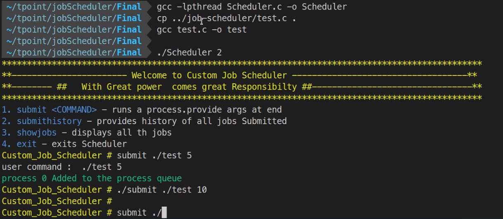
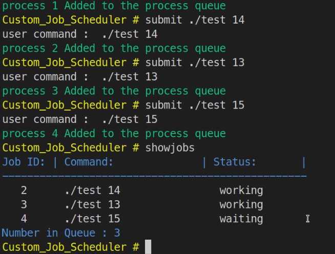

# JOb Scheduler

Schedules a job using pthreads built using C Language


## Compilation 

```
gcc -lpthread Scheduler.c -o Schedule
```

## Running

`./Scheduler <Num Of processors>` , So if we need to run 4 process contigiously on 4 threads then we need to use 

```
./Scheduler 4
```


## Commands

- submit - Submits a file
- showjobs - Displays running jobs
- submithistory - show history of jobs and their status

## Output

the output of all files will be saved in `outLog` files.


## output

<br />
<br />

